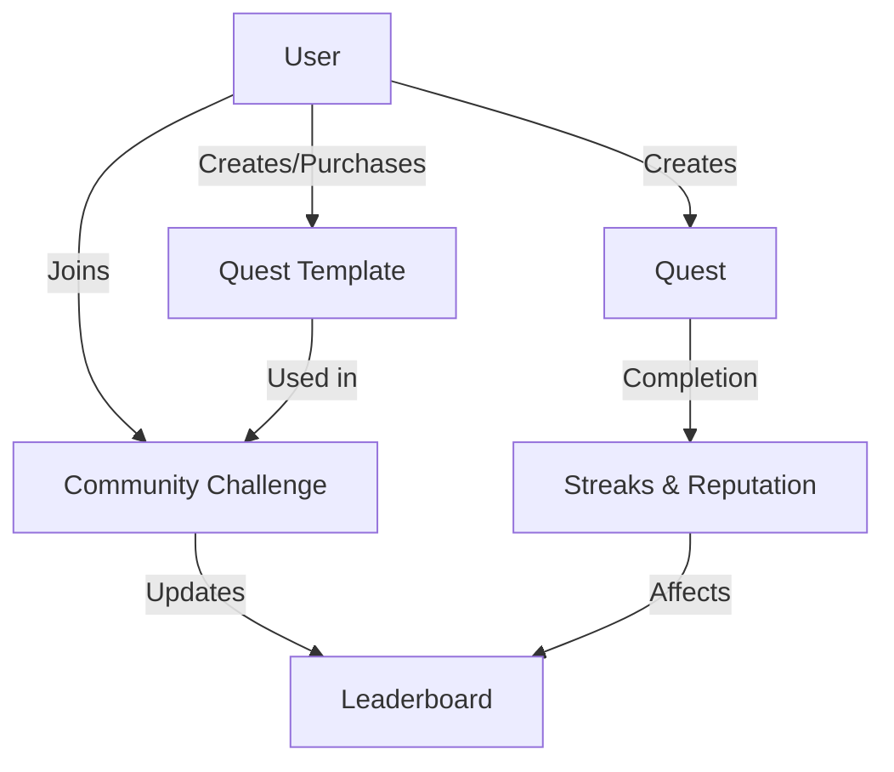

# Optimistic Composite Sanitizer

An advanced smart contract for secure, efficient, and flexible data validation and transformation.

## Overview

Optimistic Composite Sanitizer is an innovative blockchain solution that provides a robust framework for optimistic validation, data integrity checks, and flexible compositional management. It leverages advanced Clarity techniques to create a secure, transparent, and extensible system for data processing and verification.

### Key Features

- Modular and composable data validation mechanisms
- Optimistic validation strategy with multiple verification layers
- Flexible data transformation and sanitization
- Secure state management with fine-grained access controls
- Reputation-based authorization and governance
- Transparent and verifiable data processing
- Advanced error handling and recovery mechanisms

## Architecture

The system is built on a single smart contract that manages all core functionality through interconnected data structures and functions.



### Core Components

1. **Quests**: Personal habit tracking units with customizable parameters
2. **User Profiles**: Track reputation, streaks, and overall progress
3. **Quest Templates**: Shareable and purchasable quest blueprints
4. **Community Challenges**: Group competitions based on shared templates
5. **Leaderboards**: Track participant progress in challenges

## Contract Documentation

### Quest Management

#### Creating Quests

```clarity
(create-quest 
  name: string-ascii
  description: string-utf8
  frequency: uint
  custom-interval: optional uint
  difficulty: uint
  rewards: uint
  template-id: optional uint) -> (response uint uint)
```

Creates a new quest with specified parameters. Returns the new quest ID.

#### Completing Quests

```clarity
(complete-quest quest-id: uint) -> (response bool uint)
```

Logs completion of a quest and updates streaks, reputation, and challenge leaderboards if applicable.

### Community Features

#### Creating Templates

```clarity
(create-quest-template
  name: string-ascii
  description: string-utf8
  frequency: uint
  custom-interval: optional uint
  difficulty: uint
  recommended-rewards: uint
  for-sale: bool
  price: uint) -> (response uint uint)
```

Creates a shareable quest template that can be sold to other users.

#### Community Challenges

```clarity
(create-community-challenge
  name: string-ascii
  description: string-utf8
  quest-template-id: uint
  start-date: uint
  end-date: uint) -> (response uint uint)
```

Creates a community challenge based on a quest template.

## Getting Started

### Prerequisites

- Clarinet
- Stacks Wallet
- Basic understanding of Clarity

### Installation

1. Clone the repository
2. Install dependencies with Clarinet
3. Deploy contract to local Clarinet chain or testnet

### Basic Usage

1. Create a quest:
```clarity
(contract-call? .quest-hive create-quest "Morning Meditation" "Daily 10-minute meditation" u1 none u1 u10 none)
```

2. Complete a quest:
```clarity
(contract-call? .quest-hive complete-quest u1)
```

3. Join a community challenge:
```clarity
(contract-call? .quest-hive join-challenge u1)
```

## Function Reference

### Read-Only Functions

- `get-user-quests`: Returns list of user's quests
- `get-quest`: Returns quest details
- `get-user-profile`: Returns user profile information
- `get-quest-streak-info`: Returns streak information for a quest
- `get-challenge-leaderboard`: Returns challenge leaderboard data

### Public Functions

- `create-quest`: Create new quest
- `complete-quest`: Log quest completion
- `create-quest-template`: Create shareable template
- `join-challenge`: Join community challenge
- `purchase-template`: Purchase quest template
- `toggle-quest-active`: Toggle quest active status

## Development

### Testing

Run tests using Clarinet:
```bash
clarinet test
```

### Local Development

1. Start local Clarinet console:
```bash
clarinet console
```

2. Deploy contract:
```bash
(contract-call? .quest-hive ...)
```

## Security Considerations

### Limitations

- Quest completion verification relies on self-reporting
- Community challenges have participant limits
- Template purchases require sufficient reputation

### Best Practices

- Always verify transaction success
- Monitor streak calculations for accuracy
- Consider gas costs when interacting with multiple functions
- Verify quest ownership before modifications
- Keep private keys secure when interacting with mainnet